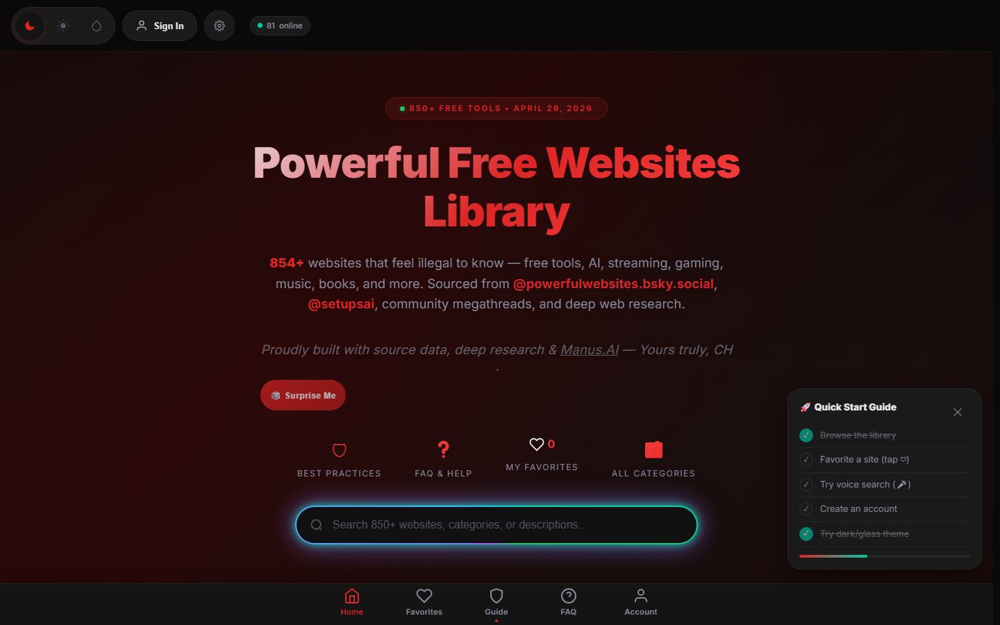

# Powerful Free Websites Library

A searchable, installable collection of **useful websites and browser tools** across AI, design, development, learning, privacy, entertainment, and more. The directory prioritizes clear descriptions, visible limitations, and direct links rather than sponsored rankings.

**Live:** [powerful-websites-library.vercel.app](https://powerful-websites-library.vercel.app)

## Features

- Fast full-catalog search with curated categories and quick search trails.
- Monthly editorial feature and a regularly refreshed Fresh Signals shelf.
- Browser-only saved links using `localStorage`; no account, sign-in, cloud sync, or tracking profile is required.
- Dark, cinematic, mobile-responsive interface with touch-friendly controls and a reduced-motion mode.
- Installable PWA with offline support.
- Companion pages for the library manifesto, tools, and best practices.

## August 2026 refresh

The August update adds **DeepWiki**, **Websim**, **WhatFontIs**, **Omatsuri**, **Mobirise AI**, and **tldraw**. **DeepWiki** is now the Site of the Month. Retired account-era pages redirect to the public library.

## Tech

Static HTML5, CSS3, and JavaScript with service-worker PWA support and Vercel static deployment.
