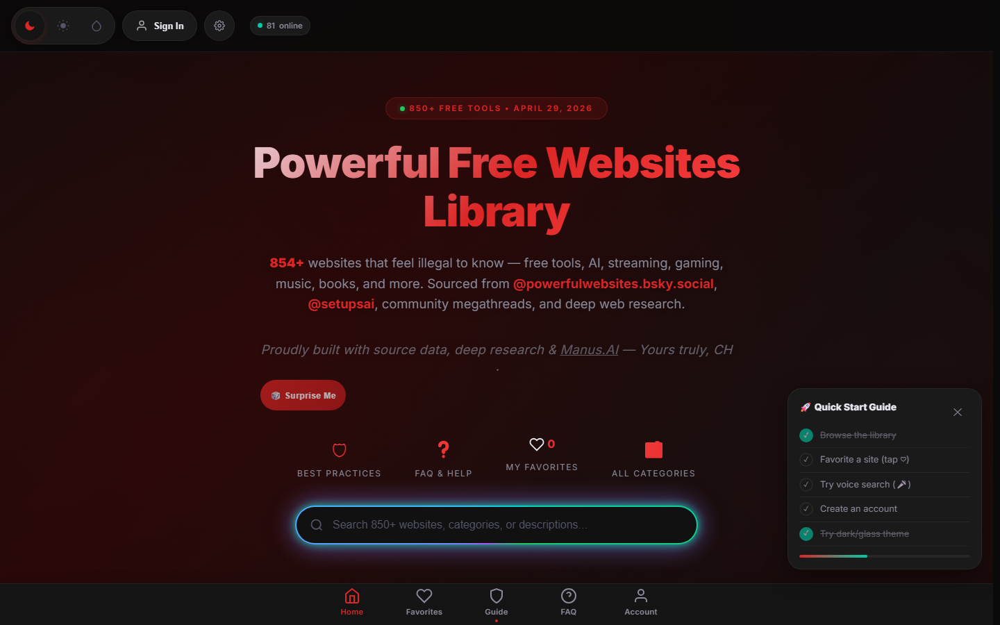

# Powerful Free Websites Library

A searchable, installable collection of **useful websites and browser tools** across AI, design, development, learning, privacy, entertainment, and more. The directory prioritizes clear descriptions, visible limitations, and direct links rather than sponsored rankings.

**Live:** [www.ntkwebsites.com](https://www.ntkwebsites.com)

## Features

- Fast full-catalog search with curated categories and quick search trails.
- **No login filter.** Every site is marked No login, Login optional, or Account required. One switch (in the directory bar, the search panel, or the "No login needed" shortcut) hides everything that makes you sign up first. Link to it with `/?login=none`.
- Browser-only saved links using `localStorage`; no account, sign-in, cloud sync, or tracking profile is required.
- Dark, cinematic, mobile-responsive interface with compact phone cards, touch-friendly controls and a reduced-motion mode.
- Installable PWA with offline support.

## September 2026 audit

- Every catalogued URL was fetched. `catalog-audit.js` removes 84 sites that shut down, lost their domain, or were hijacked (one former AI tool domain now redirects to a gambling site), and moves 82 sites to their new addresses or names.
- `access-map.js` records whether each site needs a login; uncertain ones were checked on the site itself.
- `data-extra-14.js` adds 90 free sites, 79 of them usable with no login (PairDrop, cobalt, BentoPDF, SwissTransfer, Duck.ai, Lumo, Mermaid Live, Lichess and more).
- The homepage shell dropped from 406 KB to 106 KB by removing the retired account-era interface. On a mid-range Android phone first paint went from 4.0 s to 2.2 s.
## Tech

Static HTML5, CSS3, and JavaScript with service-worker PWA support and Vercel static deployment.
